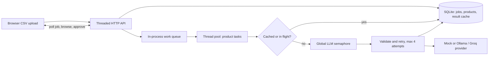

# CatalogIQ system design

## 1. Architecture and concurrency

The browser parses the selected CSV and submits a JSON list. The API validates it, persists a job and its product rows, schedules item tasks, and returns the job identifier. A thread pool runs independent product tasks so the HTTP server can keep serving reads and status polls. A process-wide bounded semaphore wraps every provider call, so overlapping jobs share the same `LLM_CONCURRENCY` cap. A per-content in-flight future lets simultaneous duplicates wait for one owner call. Completed responses are stored in SQLite and reused. Each provider attempt is validated; errors and malformed output use up to four total attempts with 200, 400, and 800 ms backoff.

Threads fit this workload because waiting on remote HTTP requests is the dominant cost and keep the implementation easy to inspect. Async would scale to more open sockets, while processes add coordination costs without helping network-bound work. SQLite WAL and short-lived connections allow concurrent readers while transactions protect updates.

## 2. Crash recovery

SQLite keeps catalogue and completed cache results across restarts. The current demo queue is in memory, so jobs left `running` at a crash would not resume automatically; unfinished products remain failed/pending-like rows and the submitted job's progress would be incomplete. A production version should persist a per-job item table with `queued`, `running`, `done`, and `failed` states, claim work transactionally with a lease, and reclaim expired leases on startup. A durable broker (for example Redis Streams or a database-backed queue) can deliver work at least once; idempotent cache keys and SKU upserts prevent repeated completed work. Recovery should reset stale `running` job state, enqueue all nonterminal item rows, and recompute counters from item states.

## 3. Scale and cost

At one million listings/day, first normalize and hash content, then deduplicate before spending tokens. Batch compatible products into one prompt and map structured responses back by stable item IDs, while measuring batch error rates and splitting/retrying failed batches. A durable queue separates API intake from workers. Enforce both a shared requests-per-minute token bucket and an in-flight semaphore across machines; a local semaphore alone is not globally safe. Apply provider backoff and jitter, observe quotas, and route to a second provider only under explicit fallback policy. Cache successful enrichments and keep prompts compact. Sample low-confidence/high-value products for review rather than paying for universal second passes.

## 4. API performance at five million products

The demo's `%term%` search scans rows and cannot use a normal B-tree index; offset pagination also becomes expensive at deep pages. Add SQLite FTS5 (or a production search service) over raw and clean titles, maintain it on writes, and use indexed category/SKU constraints. Prefer keyset pagination (`sku > last_sku`) for stable catalogue browsing; retain offsets only for shallow pages if the contract requires numbered pages. Cache common queries briefly and invalidate on relevant writes. Measure query plans and latency before choosing a distributed search index.

## 5. Quality and human review

Validate schema and category values at the provider boundary and preserve the raw listing next to the normalized result. In production, attach confidence signals from model output, extraction agreement, category/brand dictionaries, and anomaly checks (for example unknown brand or quantity changes). Route low-confidence or high-impact records to human review, track edits as feedback, and evaluate on a labeled sample by category and supplier. The demo exposes failed records and lets reviewers edit title/category/tags before approval; it does not claim calibrated confidence.
